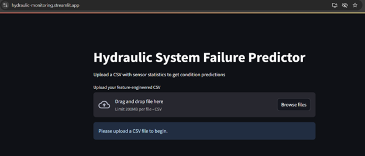
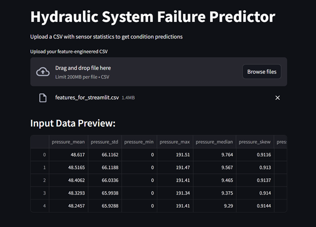
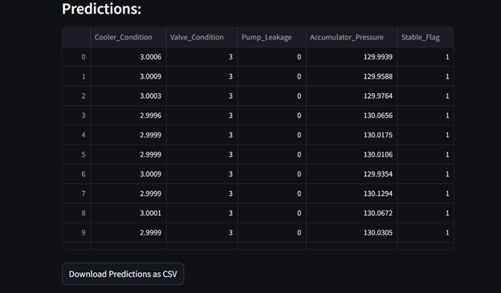

🛠️ Streamlit Hydraulic Dashboard 

Predictive maintenance for hydraulic systems using sensor data, XGBoost modeling, and an interactive Streamlit app.

📦 Project Overview
This end-to-end machine learning project enables early detection of hydraulic failures—such as pump leakage or valve issues—using real-world-like sensor data from industrial systems. It helps reduce downtime and increase equipment reliability through intelligent monitoring and batch predictions.

Built with:

Python, pandas, XGBoost, SHAP

Streamlit for interactive dashboard deployment

🏭 Industry Context
Hydraulic systems are widely used in automotive, aerospace, and manufacturing. Failures like accumulator pressure loss or cooler degradation can lead to unexpected shutdowns and costly repairs.

By processing time-series data from pressure, temperature, vibration, and flow sensors, this project helps maintenance teams anticipate faults before they occur.

🔍 Key Features
✅ Load and preprocess over 20 raw .txt sensor files
✅ Perform exploratory data analysis (EDA)
✅ Extract cycle-level statistical features (~49 total)
✅ Train 5 supervised models (regression and classification)
✅ Apply SHAP for interpretability
✅ Build and deploy a web-based dashboard via Streamlit
✅ Support batch .csv uploads and download predictions

🔄 Project Pipeline
Phase	Description
01_load_data.ipynb	Load raw .txt files, organize into grouped DataFrames (sensor_data)
02_eda.ipynb	Explore signal structure, missing values, and label distributions
03_feature_engineering.ipynb	Calculate 7 statistical metrics per signal group (mean, std, skew, etc.)
04_modeling.ipynb	Train and evaluate 5 XGBoost models; save .joblib files
technical_documentation.pdf	Summarize development process, lessons learned, and visual outputs
architecture.pdf	Visual diagram of workflow and project structure
streamlit_dashboard_app.py	Frontend dashboard: upload .csv → get predictions → download .csv

📁 All notebooks and code are available in the project repo »

🎯 Performance Metrics
Target	Type	Score
Cooler Condition	Regression	RMSE: 4.94
Accumulator Pressure	Regression	RMSE: 3.17
Valve Condition	Classification	Accuracy: 98.4%
Pump Leakage	Classification	Accuracy: 99.7%
Stable Flag	Classification	Accuracy: 96.8%

💡 SHAP Explainability
SHAP values were computed for each trained model to understand feature contributions.

Key insights:

pressure_skew, volume_flow_std, and efficiency_kurtosis had strong predictive value

SHAP summary plots provided transparent model behavior

🚀 Running the App
📦 1. Local Setup

# Clone repo
git clone https://github.com/ArturMelnyk-analyst/Streamlit-Hydraulic-Dashboard.git
cd Streamlit-Hydraulic-Dashboard

# Install dependencies
pip install -r requirements.txt

# Run Streamlit app
streamlit run streamlit_dashboard_app.py

Upload your engineered features_for_streamlit.csv file to test predictions.

🌐 2. Streamlit Cloud Deployment
App was deployed using Streamlit Cloud:

Select repo: ArturMelnyk-analyst/Streamlit-Hydraulic-Dashboard

Branch: main or feature/streamlit-app

Main file path: streamlit_dashboard_app.py

Click Deploy

📁 Project Structure

📃 License
This project is licensed under the MIT License.

## 🖼️ App Preview

### 🔹 Step 1: Upload Your Features File
This screenshot shows how the app looks before generating predictions.

---

### 🔹 Step 2: View Predictions
This shows the table of predicted labels and download option.

