# Hydraulic Condition Monitoring

[](https://hydraulic-monitoring.streamlit.app)

Live App: https://hydraulic-monitoring.streamlit.app

## Machine Learning Diagnostic System for Industrial Hydraulic Equipment

**Author:** Artur Melnyk

This project implements a machine-learning diagnostic system for hydraulic machinery. Instead of predicting a single global machine label, the system trains one dedicated model per hydraulic subsystem, reflecting how industrial equipment is monitored in practice.

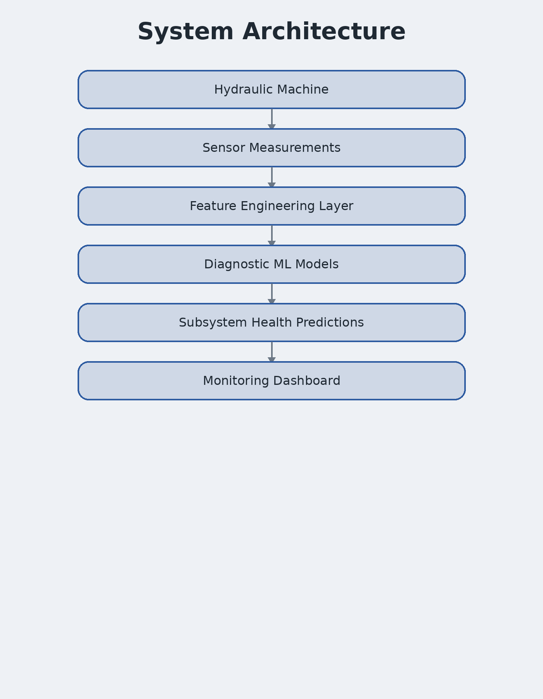

## Project Goal

Hydraulic systems are widely used in manufacturing, industrial automation, process engineering, and heavy equipment. Failures in hydraulic components can lead to:

- production downtime
- mechanical damage
- safety risk
- expensive reactive maintenance

The goal of this project is to create a subsystem-level diagnostic framework capable of identifying degradation patterns before failure occurs.

## Machine Learning Pipeline

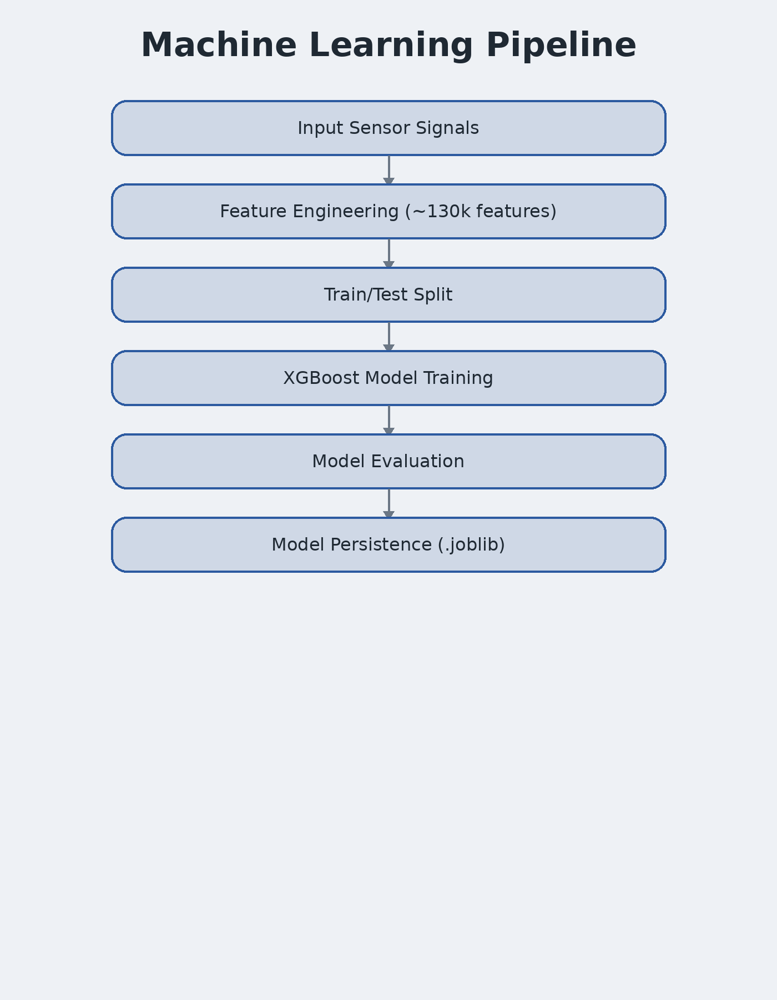

```text
Raw Sensor Data
    ↓
Data Loading
    ↓
EDA
    ↓
Feature Engineering
    ↓
Subsystem Models
    ↓
Explainability
    ↓
Streamlit Dashboard
```

## Notebook Workflow

| Notebook | Purpose |
|---|---|
| `01_load_data.ipynb` | Load and align raw sensor files |
| `02_eda.ipynb` | Explore sensor behavior and target distributions |
| `03_feature_engineering.ipynb` | Build the engineered feature space |
| `04_modeling.ipynb` | Train one model per subsystem |
| `05_model_explain.ipynb` | Interpret predictions using SHAP |

## Dataset

Source: UCI Hydraulic System Condition Monitoring dataset

Sensor groups include:

- pressure
- flow
- temperature
- vibration
- efficiency / power signals

## Exploratory Analysis

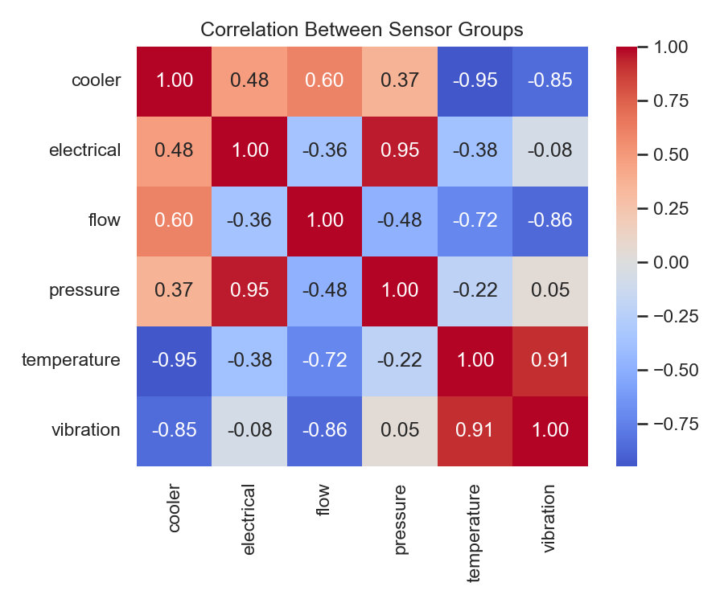

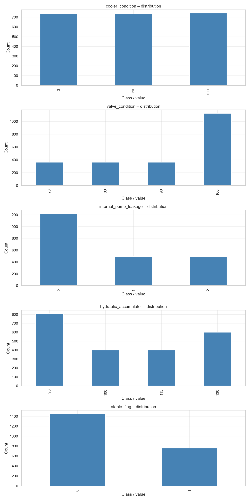

## Feature Engineering

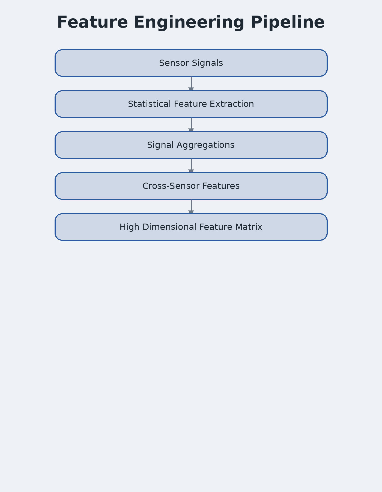

The project creates a very large engineered feature space (~130k+ features).

The modeling notebook then retains approximately 500 of the most informative features for training.

```text
Raw Sensor Signals
    ↓
130k+ Engineered Features
    ↓
~500 Retained Features
    ↓
Final Subsystem Models
```

Important distinction:

- `X_features.parquet` = aligned but not yet engineered dataset
- `X_features_fe.parquet` = final feature-engineered modeling dataset

## Subsystem Models

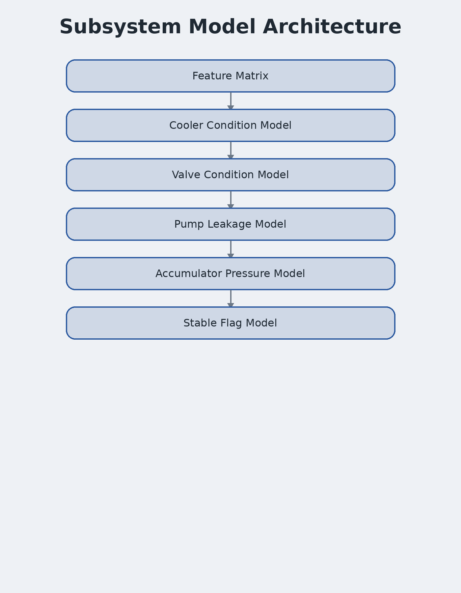

| Model File | Target |
|---|---|
| `cooler_model.joblib` | Cooler condition |
| `valve_model.joblib` | Valve degradation |
| `pump_model.joblib` | Pump leakage |
| `accumulator_model.joblib` | Accumulator pressure |
| `stable_model.joblib` | Overall system stability |

## Model Performance

| Target | Accuracy | Macro F1 |
|---|---:|---:|
| Cooler Condition | 0.995 | 0.995 |
| Valve Condition | 0.659 | 0.574 |
| Pump Leakage | 0.956 | 0.948 |
| Accumulator Pressure | 0.943 | 0.934 |
| Stable Flag | 0.943 | 0.936 |

### Important Technical Insight

The valve model performs significantly worse than the others because valve degradation produces a weaker and less separable sensor signature.

```text
Valve degradation
    ↓
Weak sensor signal
    ↓
Lower separability in feature space
    ↓
Lower model performance
```

This is primarily a data and physics limitation, not a modeling failure.

## Explainability

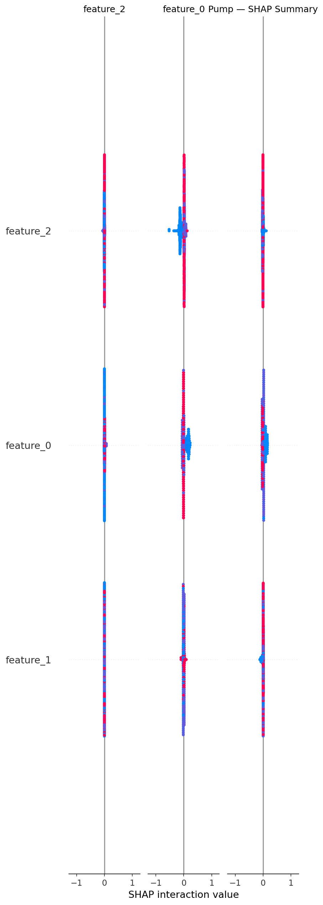

The project includes SHAP-based explainability to identify which engineered features most strongly influence each subsystem model.

## Dashboard

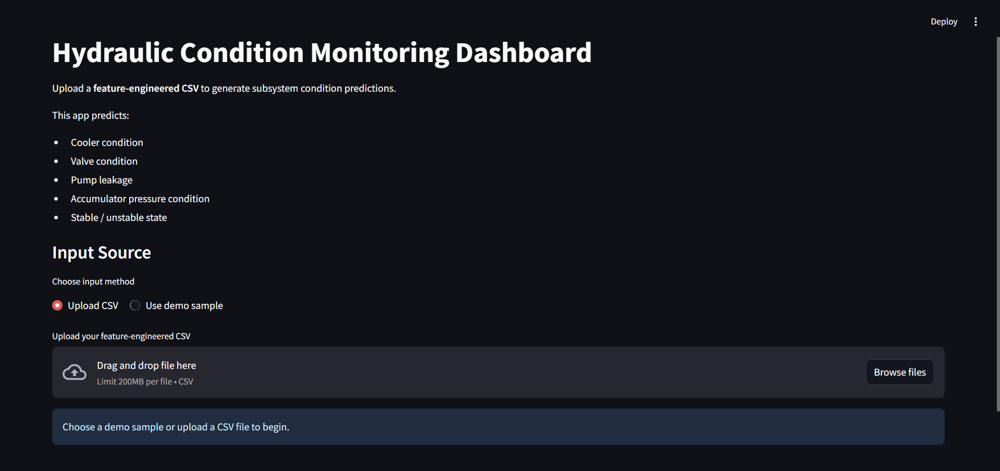

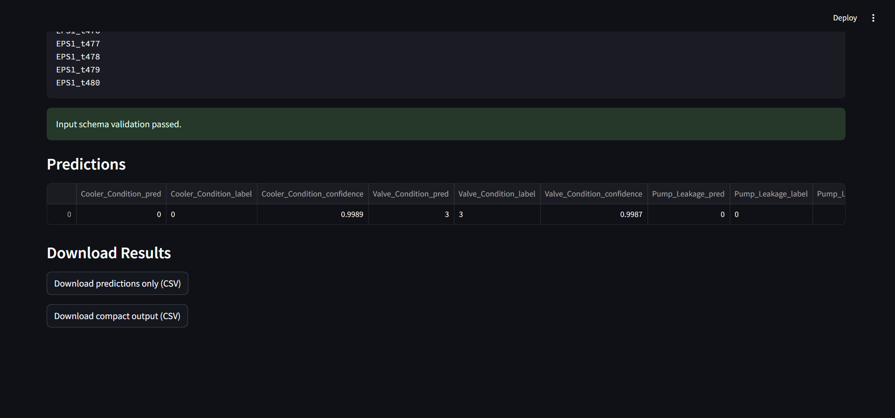

The dashboard:

- loads trained models
- aligns input features using `artifacts/feature_index.json`
- decodes predictions using label maps
- displays subsystem-level diagnostic results


## Local Validation

The Streamlit dashboard was tested locally using both uploaded CSV files and the built-in demo sample.

Validation confirmed that the application successfully:

- loaded all `.joblib` subsystem models
- aligned features using `artifacts/feature_index.json`
- validated the expected ~130k-column engineered dataset
- generated subsystem predictions and confidence scores
- exported downloadable CSV results

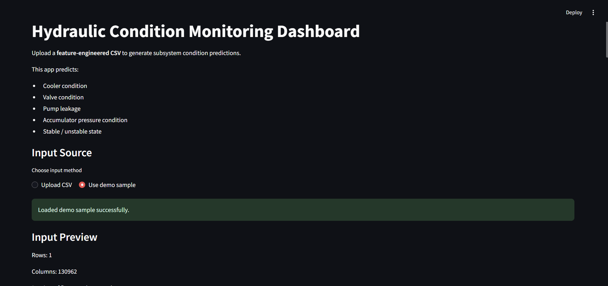

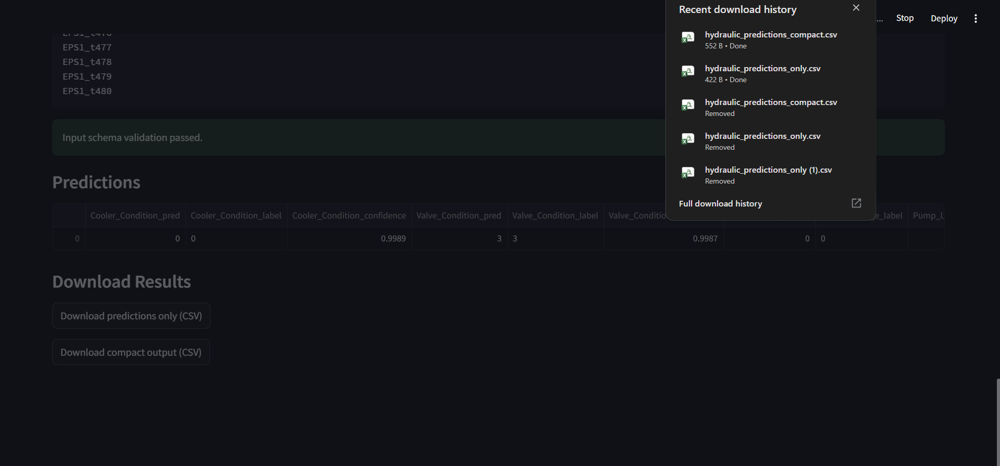

## Run Locally

```bash
pip install -r requirements.txt
streamlit run streamlit_dashboard_app.py
```

The cloud deployment reproduces the same environment using:

- `requirements.txt`
- `runtime.txt`

