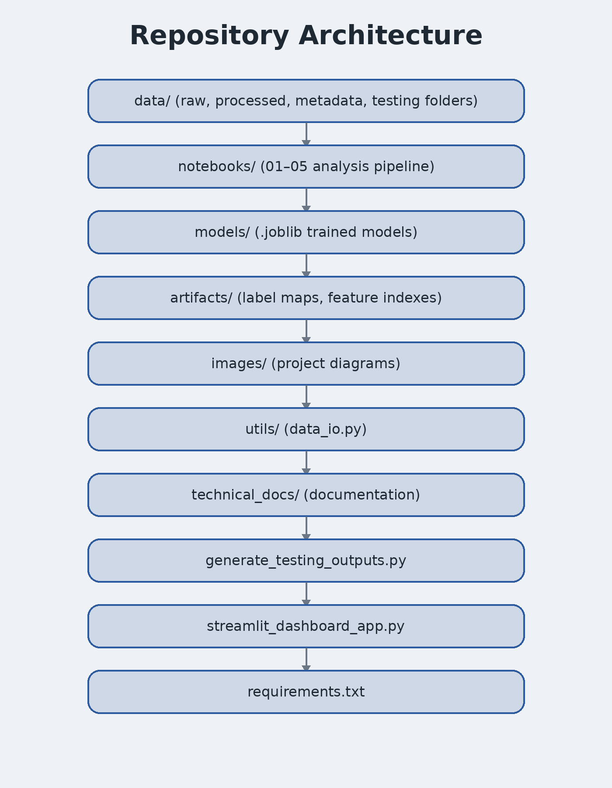

# Architecture
## Hydraulic Diagnostic System Architecture

This project is designed as a modular industrial monitoring system rather than a single end-to-end classifier.


## High-Level Flow

```text
Hydraulic Machine
    ↓
Sensor Measurements
    ↓
Base Processed Dataset
    ↓
Feature Engineering
    ↓
Subsystem Models
    ↓
Explainability Layer
    ↓
Dashboard Predictions
```

## Full Data Flow


```text
Raw Sensor Files
    ↓
01_load_data.ipynb
    ↓
X_features.parquet + y_labels.parquet
    ↓
02_eda.ipynb
    ↓
03_feature_engineering.ipynb
    ↓
X_features_fe.parquet
    ↓
04_modeling.ipynb
    ↓
.joblib Models + Inference Artifacts
    ↓
05_model_explain.ipynb
    ↓
streamlit_dashboard_app.py
```

## Subsystem-Level Modeling Strategy


| Physical Subsystem | Diagnostic Target |
|---|---|
| Cooler | `Cooler_Condition` |
| Valve | `Valve_Condition` |
| Pump | `Pump_Leakage` |
| Accumulator | `Accumulator_Pressure` |
| Stability | `Stable_Flag` |

Why this architecture is stronger than a single global model:

- clearer interpretation
- independent retraining
- easier maintenance
- closer alignment with real industrial monitoring practice

## Feature Engineering Architecture


Notebook 03 generates approximately 130k engineered features.

Notebook 04 then retains approximately 500 features for training.

```text
Raw Features
    ↓
130k+ Engineered Features
    ↓
~500 Selected Features
    ↓
XGBoost Models
```

## Data Contracts

The repository uses stable intermediate artifacts between notebooks.

```text
data/processed/X_features.parquet
data/processed/y_labels.parquet
data/processed/X_features_fe.parquet
artifacts/feature_index.json
artifacts/<target>_label_map.json
```

Important distinction:

- `X_features.parquet` = aligned but not yet engineered
- `X_features_fe.parquet` = final modeling matrix
- `feature_index.json` = required feature order during inference

## Prediction Flow


```text
Input Features
    ↓
Feature Alignment
    ↓
Subsystem Models
    ↓
Prediction Decoding
    ↓
Dashboard Results
```

The dashboard uses:

- `artifacts/feature_index.json`
- `<target>_label_map.json`

to ensure that predictions remain consistent across environments.

## Repository Structure



```text
hydraulic_dashboard/
├── data/
├── notebooks/
├── models/
├── artifacts/
├── images/
├── utils/
├── technical_docs/
├── streamlit_dashboard_app.py
├── generate_testing_outputs.py
├── requirements.txt
└── runtime.txt
```


## Deployment Environment Consistency

The Streamlit application is reproduced across environments using:

- `requirements.txt`
- `runtime.txt`
- `artifacts/feature_index.json`
- `<target>_label_map.json`

This ensures that local predictions and deployed predictions remain identical.


## Validation Layer

`generate_testing_outputs.py` provides lightweight regression testing.

It verifies:

- saved models still load
- dashboard predictions remain unchanged
- inference artifacts remain aligned after updates
