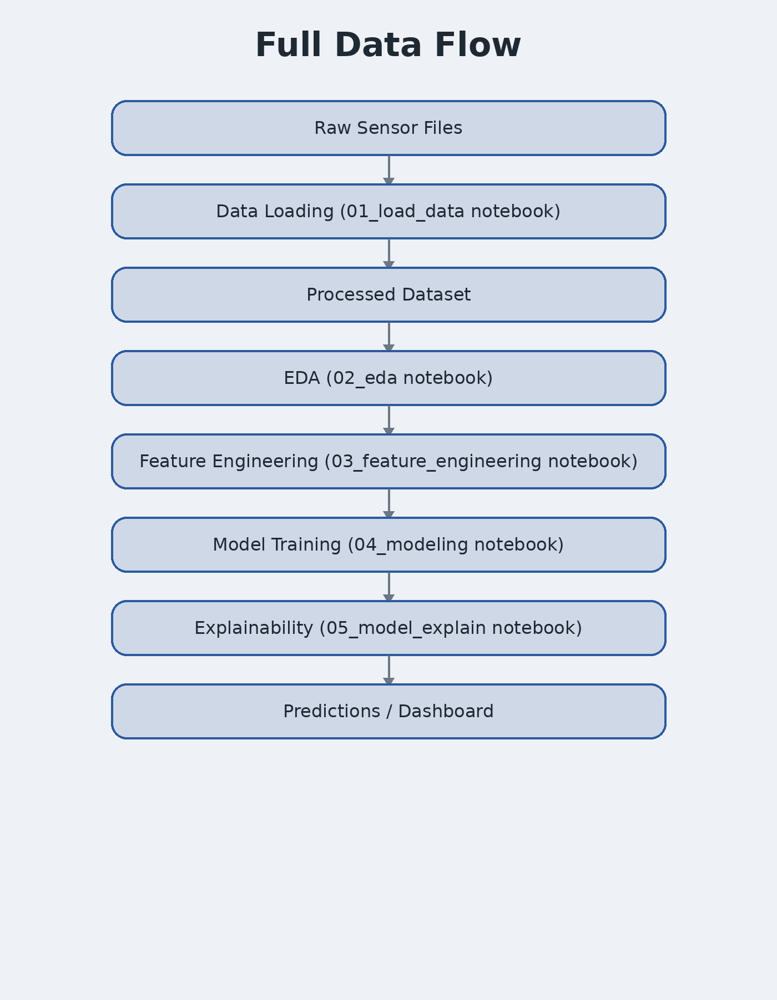
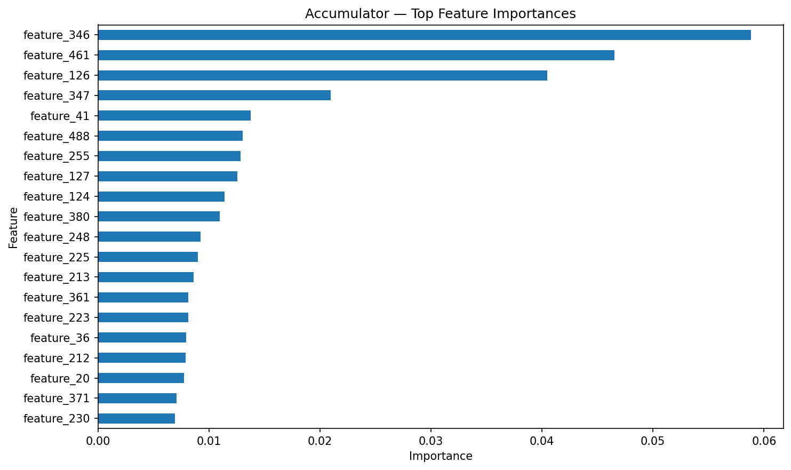
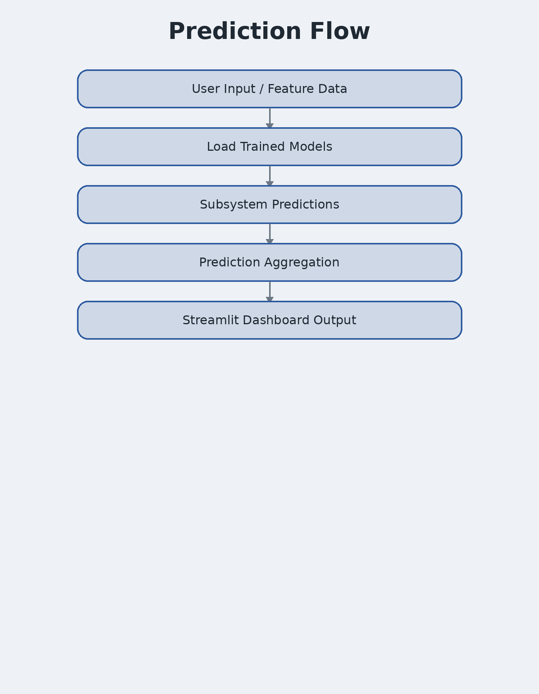

# Technical Case Study
## Hydraulic Predictive Maintenance using Machine Learning

**Author:** Artur Melnyk

## Executive Summary

Hydraulic failures create downtime, repair costs, and safety risk.

Traditional maintenance strategies are often reactive or schedule-based.

This project introduces a machine-learning diagnostic system that predicts subsystem degradation before failure occurs.



## Problem Definition

Hydraulic systems consist of multiple interacting subsystems:

- cooling system
- valve system
- pump
- accumulator
- overall stability state

Instead of asking "Is the machine broken?", the project asks:

- Is the pump leaking?
- Is the accumulator degraded?
- Is the valve failing?
- Is the cooling system working correctly?

This is the central reason the project uses one model per subsystem.

## Machine Learning Pipeline


```text
Sensor Data
    ↓
Notebook 01: Data Assembly
    ↓
Notebook 02: Exploratory Validation
    ↓
Notebook 03: Feature Engineering
    ↓
130k+ Engineered Features
    ↓
~500 Retained Features
    ↓
Notebook 04: XGBoost Models
    ↓
Notebook 05: SHAP Explainability
    ↓
Streamlit Dashboard
```

## Feature Engineering


The feature-engineering stage produces a very large feature space.

Because training on all features is computationally expensive, the final pipeline retains approximately 500 features for model training.

## Modeling Architecture


This design closely matches real predictive-maintenance systems, where different failure modes are monitored independently.

## Performance

| Target | Accuracy | Macro F1 |
|---|---:|---:|
| Cooler | 0.995 | 0.995 |
| Valve | 0.659 | 0.574 |
| Pump | 0.956 | 0.948 |
| Accumulator | 0.943 | 0.934 |
| Stable | 0.943 | 0.936 |

## Critical Technical Insight

The valve model is the weakest subsystem model.

```text
Valve degradation
    ↓
Weak physical signature
    ↓
Greater overlap between classes
    ↓
Lower model performance
```

This indicates that the limitation comes from the hydraulic signal itself rather than from the machine-learning method.

## Explainability



The SHAP analysis strengthens the project by showing which engineered features influence each subsystem prediction.

## Deployment



The dashboard:

- loads trained subsystem models
- aligns incoming features using `feature_index.json`
- decodes predictions using label maps
- returns a complete subsystem-level diagnostic summary


## Local Application Validation

The deployed Streamlit dashboard was tested locally using generated feature-engineered samples.

The validation process confirmed that:

- trained models load correctly
- feature order is preserved through `feature_index.json`
- predictions remain consistent across all subsystem models
- exported CSV outputs match displayed predictions


## Conclusion

The project demonstrates:

- a modular subsystem-based architecture
- strong feature engineering
- explainable machine learning
- reproducible model artifacts
- deployment through an interactive dashboard

This makes the project significantly stronger than a single-notebook classification example.
